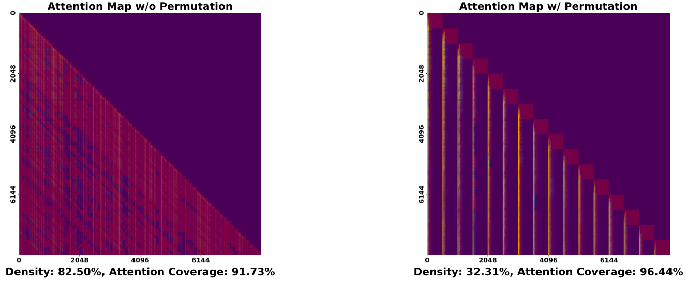
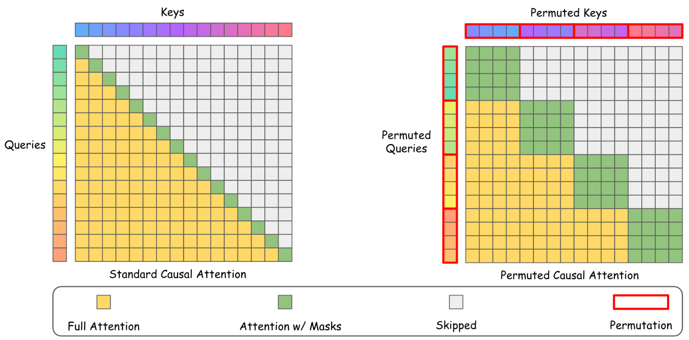

# Sparser Block-Sparse Attention via Token Permutation
<a href="https://arxiv.org/abs/2510.21270" target="_blank"> </a>


## ✨ TL;DR
We introduce Permuted Block-Sparse Attention (**PBS-Attn**), a plug-and-play method that leverages the permutation properties of attention to increase block-level sparsity and boost efficiency of LLM prefilling.

## 💡 Core Concepts
We apply token permutation which allows us to select far fewer blocks while still covering the important key tokens, which look like the following:


The permutation is done within segments so that we don't break causality for LLMs:



## 🚀 Setup
### Main Installation
Get started with a one-liner installation of PBS-Attn:
```
pip install -e .
```
### Dependencies
To reproduce the results in the paper, you'll need [OpenCompass](https://github.com/open-compass/opencompass) for evaluation:
```
pip install datasets==3.6.0 opencompass==0.4.2
```

To run the baseline comparisons, please install their respective packages:
```
# Flash Attention
pip install ninja
pip install flash-attn --no-build-isolation

# Minference
pip install minference

# XAttention 
git clone https://github.com/mit-han-lab/Block-Sparse-Attention.git
cd Block-Sparse-Attention
python setup.py install
cd ..
```

## Example Usage
```
from pbs_attn.patch.huggingface import apply_patch_with_prefill, get_permuted_block_sparse_attn_fwd
from transformers import AutoModelForCausalLM, AutoTokenizer
import torch

model = AutoModelForCausalLM.from_pretrained("meta-llama/Llama-3.1-8B-Instruct", torch_dtype=torch.bfloat16, device_map="auto")
tokenizer = AutoTokenizer.from_pretrained("meta-llama/Llama-3.1-8B-Instruct")

prompt = "A very long and annoying prompt that will take a while."
inputs = tokenizer(prompt, return_tensors="pt").to(model.device)

model = apply_patch_with_prefill(model, get_permuted_block_sparse_attn_fwd())

output = model.generate(**inputs, max_new_tokens=30, do_sample=False)
print(tokenizer.decode(output[0], skip_special_tokens=True))
```
## 📊 Evaluation
We provide one-liner scripts for easy reproduction. You can also modify the scripts for specific evaluations (e.g., certain baselines, different setups).
### LongBench
```
bash scripts/eval_longbench.sh
```
### LongBenchv2
```
bash scripts/eval_longbenchv2.sh
```
### Efficiency
```
bash scripts/eval_efficiency.sh
```
## 📜 Citation
If you find our code useful, please kindly cite our paper as the following:
```
@misc{wang2025sparserblocksparseattentiontoken,
      title={Sparser Block-Sparse Attention via Token Permutation}, 
      author={Xinghao Wang and Pengyu Wang and Dong Zhang and Chenkun Tan and Shaojun Zhou and Zhaoxiang Liu and Shiguo Lian and Fangxu Liu and Kai Song and Xipeng Qiu},
      year={2025},
      eprint={2510.21270},
      archivePrefix={arXiv},
      primaryClass={cs.CL},
      url={https://arxiv.org/abs/2510.21270}, 
}
```